# ClinicMaster Kafka Multi-Facility  Data Streaming

## Overview

This document outlines a scalable, Docker-based Change Data Capture (CDC) pipeline that streams healthcare data from multiple facilities to a central data warehouse. Each facility runs a lightweight Kafka Connect container that captures changes from their local SQL Server database and streams them to shared Kafka topics, where a central JDBC sink replicates the data into PostgreSQL.

## Architecture

### Data Flow

1. **Facility-Level Capture**: Each facility deploys a Docker container with Kafka Connect and Debezium
2. **Central Aggregation**: All facilities stream to shared Kafka topics with facility metadata
3. **Data Warehouse**: A single JDBC sink replicates all data into PostgreSQL with facility isolation

### System Diagram

```mermaid

graph TB
    subgraph "🏥 Kayunga Regional refferal<br/>Windows Server 2019"
        A1[SQL Server 2019<br/>ClinicMasterMOH<br/>192.168.1.40:67897] --> A2[Debezium Connector<br/>+ facility_dhis2_code: 12345]
        A2 --> A3[🐳 Kafka Connect<br/>Docker on Windows]
    end
    
    subgraph "🏥 Luwero General Hospital<br/>Ubuntu 22.04 LTS"
        B1[SQL Server 2022<br/>ClinicMasterMOH<br/>10.0.1.50:1433] --> B2[Debezium Connector<br/>+ facility_dhis2_code: 67890]
        B2 --> B3[🐳 Kafka Connect<br/>Docker on Linux]
    end
    
    subgraph "🏥 Yumbe Regional refferal<br/>CentOS 8 Stream"
        N1[SQL Server 2017<br/>ClinicMasterMOH<br/>172.16.0.100:1433] --> N2[Debezium Connector<br/>+ facility_dhis2_code: 54321]
        N2 --> N3[🐳 Kafka Connect<br/>Docker on MacOs]
    end
    
    subgraph "☁️ Central Data Center<br/>AWS/Azure"
        A3 -.->|secure Tunnel| CK[📊 Central Kafka Cluster<br/>3 Brokers<br/>Shared Topics]
        B3 -.->|secure Tunnel| CK
        N3 -.->|secure Tunnel| CK
        CK --> CS[🔄 JDBC Sink Connector<br/>Multi-Table Handler]
        CS --> PG[🗄️ PostgreSQL 15<br/>Data Warehouse<br/>High Availability]
    end
    
    subgraph "📋 Data Warehouse Tables<br/>Multi-Tenant Design"
        PG --> T1[👥 public.Visits<br/>+ facility_dhis2_code<br/>+ facility_name]
        PG --> T2[🏥 public.Patients<br/>+ facility_dhis2_code<br/>+ facility_name]
        PG --> T3[📅 public.Appointments<br/>+ facility_dhis2_code<br/>+ facility_name]
        PG --> T4[💊 public.Medications<br/>+ facility_dhis2_code<br/>+ facility_name]
    end
    
    style A1 fill:#e1f5fe
    style B1 fill:#e8f5e8
    style N1 fill:#fff3e0
    style CK fill:#f3e5f5
    style PG fill:#e0f2f1
    style T1 fill:#fce4ec
    style T2 fill:#fce4ec
    style T3 fill:#fce4ec
    style T4 fill:#fce4ec

```



## Key Design Principles

### Shared Topics with Facility Metadata
- **Single topic per table** across all facilities (e.g., `clinicmasterwarehouse-sqlserver.ClinicMasterMOH.dbo.Visits`)
- **Facility identification** via `facility_dhis2_code` and `facility_name` in every record
- **Collision-free upserts** using composite keys that include facility code

### Docker-Based Deployment
- **One container per facility** with minimal configuration
- **Environment-driven setup** via `.env` files
- **Auto-connector creation** on container startup

### Error Resilience

- **Dead Letter Queue (DLQ)** for failed records. A Dead Letter Queue (DLQ) is a safety mechanism in streaming systems that isolates failed messages (e.g., due to schema errors or invalid data) after retries, routing them to a separate topic/queue. This keeps the main pipeline flowing uninterrupted while preserving "dead" records for later debugging, reprocessing, or analysis—preventing data loss without blocking consumers.
- **Error tolerance** to keep connectors running
- **Auto-table creation** and schema evolution

## Source Connector Configuration

Each facility runs an identical Debezium SQL Server connector with facility-specific metadata injection:

### Core Settings
- **Database**: Local SQL Server (private network)
- **Tables**: All `dbo.*` tables via regex
- **Topic Prefix**: `clinicmasterwarehouse-sqlserver` (shared across facilities)
- **Snapshot Mode**: `when_needed` for efficiency
- **Heartbeat**: 30-second intervals for low-traffic databases

### Facility Metadata Injection

```json
"transforms": "unwrap,addFacilityCodeValue,addFacilityNameValue,addFacilityCodeKey",
"transforms.addFacilityCodeValue.type": "org.apache.kafka.connect.transforms.InsertField$Value",
"transforms.addFacilityCodeValue.static.field": "facility_dhis2_code",
"transforms.addFacilityCodeValue.static.value": "__FACILITY_DHIS2_CODE__",
"transforms.addFacilityNameValue.type": "org.apache.kafka.connect.transforms.InsertField$Value", 
"transforms.addFacilityNameValue.static.field": "facility_name",
"transforms.addFacilityNameValue.static.value": "__FACILITY_NAME__",
"transforms.addFacilityCodeKey.type": "org.apache.kafka.connect.transforms.InsertField$Key",
"transforms.addFacilityCodeKey.static.field": "facility_dhis2_code",
"transforms.addFacilityCodeKey.static.value": "__FACILITY_DHIS2_CODE__"

```

### Resulting Event Structure

```json
{
  "key": {"id": 123, "facility_dhis2_code": "12345"},
  "value": {
    "id": 123,
    "patient_name": "Test Patient",
    "visit_date": "2024-01-15",
    "facility_dhis2_code": "12345",
    "facility_name": "Kayunga Regional Refferal"
  }
}
```

## Sink Connector Configuration

A single JDBC sink handles all facilities with automatic table creation and error handling:

### Core Settings
- **Topics**: Regex pattern `clinicmasterwarehouse-sqlserver\\..*\\.dbo\\..*`
- **Target**: PostgreSQL data warehouse
- **PK Mode**: `record_key` (uses composite key with facility code)
- **Auto-Create**: Enabled for new tables
- **Auto-Evolve**: Enabled for schema changes

### Error Handling
```json
"errors.tolerance": "all",
"errors.log.enable": "true", 
"errors.log.include.messages": "true",
"errors.deadletterqueue.topic.name": "sink-dlq",
"errors.deadletterqueue.topic.replication.factor": "1"
```

### Table Routing
- **Regex Router**: Extracts table name from topic
- **Format**: `public.${topic}` (e.g., `public.Visits`)
- **Facility Isolation**: Composite primary keys prevent cross-facility collisions

## Deployment

### Facility Setup
1. **Build and push** the Docker image centrally
2. **Deploy at facility**:
   ```bash
   cp .env.sample .env
   # Edit .env with facility-specific values
   docker compose up -d
   ```
3. **Verify**: Check connector status and topic creation

### Environment Variables
```bash
# Facility identification
FACILITY_NAME=Kayunga Regional refferal
FACILITY_DHIS2_CODE=12345

# Database connection
DB_HOST=192.168.1.100
DB_PORT=1433
DB_USER=SA
DB_PASS=your_password
DB_NAME=ClinicMasterMOH

# Central Kafka
KAFKA_BOOTSTRAP_SERVERS=central-kafka-1.example.com:9093
KAFKA_USER=facility-user
KAFKA_PASS=your_kafka_password
```

## Benefits

### Scalability
- **Zero-configuration scaling**: Add facilities by deploying containers
- **Shared infrastructure**: Single sink handles all facilities
- **Auto-discovery**: New tables automatically create PostgreSQL tables

### Operational Excellence
- **Docker-based**: Consistent deployment across facilities
- **Error resilience**: DLQ and error tolerance prevent data loss
- **Monitoring**: Centralized visibility into all facility data

### Data Quality
- **Facility isolation**: Composite keys prevent data collisions
- **Schema evolution**: Automatic handling of table changes
- **Audit trail**: Facility metadata in every record

## Monitoring and Maintenance

### Key Metrics
- **Connector status** per facility
- **Topic lag** and throughput
- **DLQ growth** for error tracking
- **PostgreSQL table health**

### Troubleshooting
- **Check connector logs**: `docker logs clinicmasterwarehouse`
- **Verify topics**: `curl http://localhost:8083/connectors`
- **Monitor DLQ**: Review failed records in `sink-dlq` topic
- **Database connectivity**: Ensure VPN and firewall rules

---
